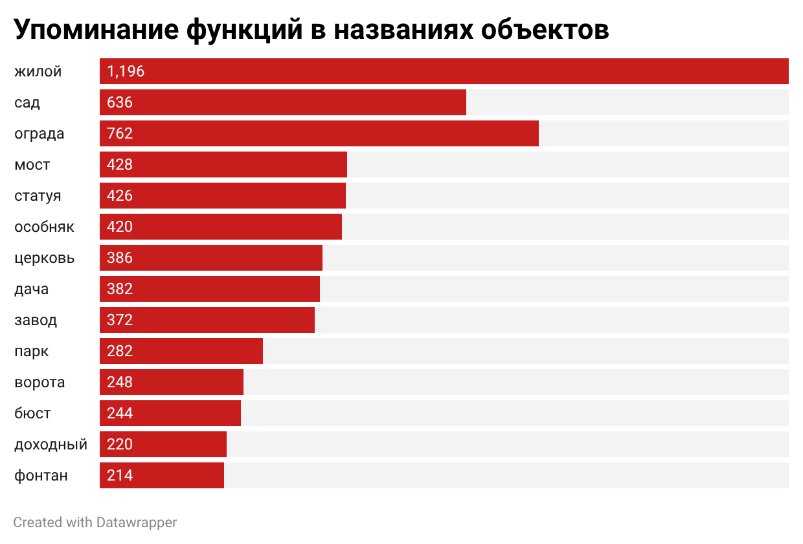

Данные: Описание источников данных и процесса их сбора и очистки. Ссылка на папку data/.
Анализ: Описание проделанного анализа и ключевые выводы. Здесь же можно вставлять изображения из папки visualizations/ для иллюстрации.
Референсы: Ссылки на статьи, исследования или другие проекты, на которые вы опирались.
Инструменты: Перечислите использованные инструменты (Google Таблицы, GitHub и т.д.).

# Из чего состоит культурное наследие Санкт-Петербурга?
> Культурное наследие Санкт-Петербурга — это тысячи объектов, от царских дворцов и доходных домов, до храмов и мемориалов. Информация об объектах культурного наследия обычно представлена в виде сложных для восприятия реестров. Из-за этого культурный облик города практически не складывается в целостную систему в сознании людей. Застройка города, в том числе объектами, которые сейчас считаются культурным наследием, — это не хаос, а обусловленный некоторыми факторами исторический процесс.

> Исследование призвано преобразовать тяжелые для понимания данные об объектах культурного наследия в наглядную карту Санкт-Петербурга. Материал рассказывает о том, какие типы объектов (жилые дома, дворцы, храмы, промышленные здания, мемориалы и т.д.) преобладают в городе, как они распределены по районам и историческим частям, каково их историко-временное распределение и с какими эпохами и архитектурными стилями связаны основные кластеры; помимо этого, как категории охраны и основания присвоения статуса соотносятся с местоположением, временем возникновения и функцией объектов. Это позволит лучше ориентироваться в культурных слоях Петербурга и взглянуть на привычные городские объекты под другим углом.

## Почему это важно?
Исследование повышает информированность в области истории и культуры Санкт-Петербурга и вызывает интерес к ней. Многие люди редко задумываются о культурной ценности зданий, парков и других объектов, которые их окружают. Этот материал позволяет привлечь внимание к теме сохранения культурного наследия и его значимости.

## На какие вопросы отвечает исследование?
1. Как географически распределяются объекты культурного наследия?
2. Какое распределение объектов к.н. по времени их возникновения?
3. Как связываются время и место появлентие объекта? (объекты какого исторического периора преобладают в конкретном районе?)
4. Какие типы объектов культурного наследия преобладают на территории Санкт-Петербурга?
5. Какая зависимость между местоположением и функцией объекта к.н., временем возникновения и функцией?
6. Каково географическое распредление объектов с разными функциями?

## Датасет: Объекты культурного наследия на территории Санкт-Петербурга.
Набор данных из портала открытых данных Санкт-Петербурга по теме культура: [Объекты культурного наследия на территории Санкт-Петербурга (Версия №19 от 24.09.2025)](https://data.gov.spb.ru/irsi/7832000069-obuekty-kulturnogo-naslediya-na-territorii-sankt-peterburga/passport/). Датасет содержит информацию об объектах культурного наследия (здания, сооружения, мемориалы, …), которые расположены на территории Санкт-Петербурга. 
Каждый объект содержит следующие признаки: 
- № 
- Наименование ансамбля _(если несколько объектов объединены в ансамбль)_
- Наименование объекта _(хотя наименование каждого объекта индивидуально, его форма близка к унифицированной, поэтому в ходе анализа будет возможно выделить функции объектов)_
- Датировка 
- Авторы _(архитектор, инженер, проектировщик, … объекта)_
- Адрес 
- Район города 
- Категория охраны _(Объект культурного наследия федерального / регионального / муниципального значения, выявленный объект культурного наследия. категории историко-культурного значения, определяющие уровень охраны объекта)_
- Основание _(на основании чего объекту присвоен статус объекта культ. наследия)_
- Примечания 
- Код объекта
### Предобработка
Данные изначально были хорошего качества, поэтому предобработка была небольшой. 
#### Пропуски
Было некоторое количество пропусков:
| Название поля, англ. | Пропуски |
|---------------------|----------|
| number              | 0        |
| name                | 4091     |
| name_object         | 0        |
| date                | 1012     |
| author              | 2695     |
| address             | 0        |
| district            | 0        |
| protection_category | 0        |
| base                | 0        |
| note                | 9005     |
| id_object           | 0        |

1. Колонку 'note' я сразу убрал, т. к. в ней нет ни одного значения;
2. пропуски в колонке 'name' обусловлены тем, что это навазние ансамбля, но далеко не каждый объект входит в ансамбль;
3. пропуски в 'date' и 'author' было решено оставить как есть, т. к. наиболее грамотный подход к их заполнению - проверка информации в интернете, но вручную это заняло бы очень много времени, к тому же авторов объектов я не анализирую.

#### Подготовка данных
1. Для более компактного представления я заменяю поля 'protection_category' и 'district' на числовые индексы
2. Даты я привожу к единому числовому виду, отсекая вторичные даты, и добавляя конкретную даты там, где она описана промежутком (_напр., первая половина 19 века_)
3. Создаю для всех дат промежутки по половинам веков для последующего анализа.
4. Нормализую колонку авторов, оставляя только инициалы и фамилию одного автора. _(я это не использую, но это может быть полезно для будущей работы)_
5. Обрабатываю адреса объектов для дальнейшего создания карты.

## Анализ материала
### *Блок 1.** Географическое и историческое распределение.
С поомщью _Google Maps_ я создал интерактивную карту всех объектов культурного наследия Санкт-Петербурга (данные об адресе которых были известны) с цветовой маркировкой времени создания объекта.  

Ссылка на карту: [SPb_Heritage_MAP_by_date](https://www.google.com/maps/d/edit?mid=15c0k8DWa6nc8QsugE-fh853ccfxI8SA&usp=drive_link)

Я создал сводную таблицу по району и историческому эпизоду появления объекта.  
| date_buckets_2 | Адмиралтейский | Василеостровский | Выборгский | Калининский | Кировский | Колпинский | Красногвардейский | Красносельский | Кронштадтский | Курортный | Московский | Невский | Петроградский | Петродворцовый | Приморский | Пушкинский | Фрунзенский | Центральный | Grand Total |
|----------------|----------------|------------------|------------|-------------|-----------|------------|-------------------|----------------|---------------|-----------|------------|---------|---------------|----------------|------------|------------|-------------|-------------|-------------|
| 1450-1499      |                |                1 |            |             |           |            |                   |                |               |           |            |         |               |                |            |            |             |             |           1 |
| 1600-1649      |                |                  |            |             |           |            |                   |              1 |               |           |            |         |               |                |            |            |             |             |           1 |
| 1650-1699      |                |                  |            |             |           |            |                   |                |               |           |            |         |               |             12 |            |            |             |             |          12 |
| 1700-1749      |             21 |               60 |          4 |             |         3 |            |                   |             10 |            27 |         2 |            |         |            32 |            127 |          1 |         20 |             |         125 |         432 |
| 1750-1799      |            172 |               56 |          9 |           6 |         8 |          2 |                10 |              3 |            19 |         3 |          4 |       7 |            22 |            104 |          4 |        219 |           3 |         238 |         889 |
| 1800-1849      |            326 |              153 |         34 |          30 |        10 |         18 |                12 |             35 |           128 |        20 |         25 |      26 |           105 |            391 |         15 |        313 |           9 |         520 |        2170 |
| 1850-1899      |            274 |              180 |         59 |          85 |        18 |         18 |                30 |             25 |           104 |        22 |         48 |      63 |           129 |            177 |         36 |        132 |          21 |         419 |        1840 |
| 1900-1949      |            211 |              154 |        174 |          73 |        85 |         30 |                20 |             18 |            45 |        99 |        112 |     124 |           358 |            119 |         39 |        167 |          60 |         358 |        2246 |
| 1950-1999      |              9 |               13 |          9 |          10 |        10 |          6 |                 9 |              7 |             1 |        17 |         56 |       5 |            21 |             21 |          4 |          9 |          28 |          24 |         259 |
| 2000-2049      |              6 |                6 |          5 |             |           |            |                 4 |              1 |            14 |        11 |          2 |         |            22 |             38 |          2 |          1 |           1 |          29 |         142 |
| Grand Total    |           1019 |              623 |        294 |         204 |       134 |         74 |                85 |            100 |           338 |       174 |        247 |     225 |           689 |            989 |        101 |        861 |         122 |        1713 |        7992 |

  
[Распределение объектов культурного наследия по районам Санкт-Петербурга в различные периоды истории.](https://www.datawrapper.de/_/svSMN/)

> ВЫВОДЫ

### **Блок 2.** Распределение по функции объекта.
с помощью питона [SPb_Heritage_processing](https://github.com/kkolesnikkov/SPb_Heritage/blob/13b9210d4efecb3acd87c9d78722d31892b62a7f/SPb_Heritage_processing.ipynb) я проанализировал названия объектов и выделил ключевые маркеры функций, которые упоминаются в названиях. После этого я смог выделить преобладающие категории объектов.  

и составить вторую интерактивную карту, на которой цветом маркируются функции объектов.  
  
Ссылка на карту: [SPb_Heritage_MAP_by_date](https://www.google.com/maps/d/edit?mid=15c0k8DWa6nc8QsugE-fh853ccfxI8SA&usp=drive_link)

После этого, предварительно проведя еще одну обработку ([SPb_Heritage_processing_2](https://github.com/kkolesnikkov/SPb_Heritage/blob/b686b14ccae23a16c2d95a5b65b4ffdebe62eaab/SPb_Heritage_processing_2.ipynb) на питоне для выделения соотношения районов и функций, составил две сводные таблицы:  
Сводная таблица: функция объекта и период его появления

.png)
[Сводная таблица: функция и район](https://www.datawrapper.de/_/KQWHZ/)

> ВЫВОДЫ

## Перспективы для улучшения
В моей работе много аспектов, которые можно было бы улучшить для получения более точных и полных результатов:  
1. сделать разбивку по временным периодам не по 50 лет, а связав с определенными историческими эпохами, например "советский период", "постсоветский период", "имперский период" и т.п.
2. заменить пропуски (и примерные значения) в столбце с датой появления объекста на проверенную точную информацию.
3. провести более аккуратную работу с авторами объектов: не оставлять одного первого, а зафиксировать каждого.
 

## Приложенные таблицы в папка /data:  
1. [SPb_Heritage_raw](https://github.com/kkolesnikkov/SPb_Heritage/blob/4f09a9dc1cb958ac7e2c4a4144b29b1476e5bcca/data/SPb_Heritage_raw.csv). Исходные данные.
2. [SPb_Heritage_processed](https://github.com/kkolesnikkov/SPb_Heritage/blob/4f09a9dc1cb958ac7e2c4a4144b29b1476e5bcca/data/SPb_Heritage_processed.csv). Обработанные и подготовленные данные.
3. [SPb_Heritage.xlsx](https://github.com/kkolesnikkov/SPb_Heritage/blob/4f09a9dc1cb958ac7e2c4a4144b29b1476e5bcca/data/SPb_Heritage.xlsx). Документ со всеми промежуточными и сводными таблицами.

## Инструменты:
1. Google Spreadsheet
2. GitHub
3. Python 3.11
4. DataWrapper
5. Google Maps

